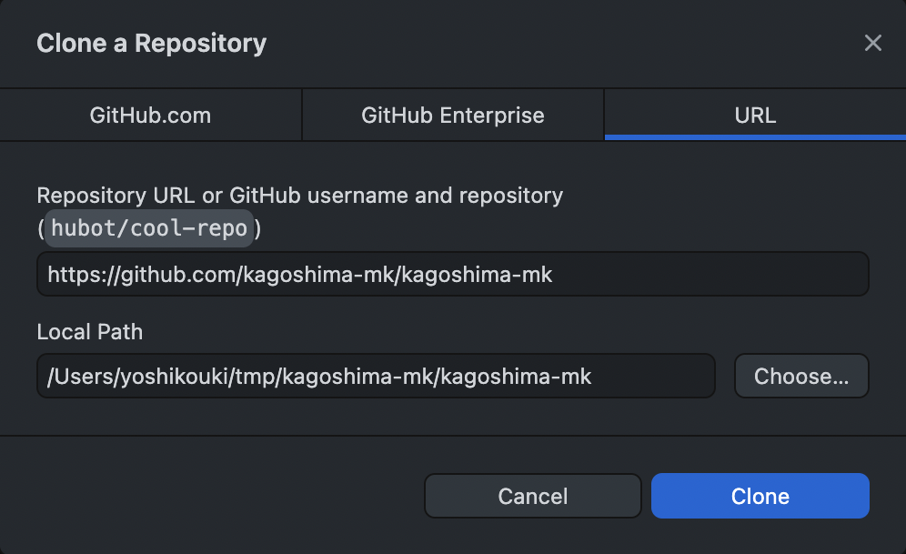

# 鹿児島.mk
プログラミング初学者や初見のエンジニアでも気軽に参加できるエンジニアコミュニティ

## connpass

https://kagoshima-mk.connpass.com/

## イベントの前準備

**とくに準備が必要のないイベントもあります。connpassのイベントページに特に書いてなければ、準備は何もしなくてOKです。**

ハンズオン形式のイベントの際のみ以下の準備が必要です。

## 1. Githubアカウントの登録

こちらの記事を参考にGitHubアカウントを登録してください。

[GitHubアカウントの作成方法 (2021年版)](
https://qiita.com/ayatokura/items/9eabb7ae20752e6dc79d)

プロフィール欄のlocationに「Kagoshima, Japan」といった形でざっくりした居住地を登録しておくと、[身近なエンジニアと繋がりやすくなります](https://kurehajime.github.io/jimoto_no_github_user/#/of/Kagoshima)。

## 2. 必要なアプリケーションをインストール

次のアプリケーションをダウンロード・インストールしてください。

1. VSCode (Visual Studio Code)
    https://code.visualstudio.com/
    - プログラムを書くエディター
    - エンジニアにも広く使われている
    - 無料で使える
2. GitHub Desktop
   https://desktop.github.com
   - プログラム・コードをダウンロード・保存・管理するアプリケーション
   - Git と呼ばれるバージョン管理ツールを使いやすくしてくれる
   - 無料で使える

## 3. 本リポジトリをPCにダウンロードする

1. GitHub Desktop を開く
2. 本リポジトリを使用しているPCにダウンロードする
   1. 上部メニュー > `File` > `Clone a Repository` を押下する
   2. `URL` のタブを選択し、以下のリポジトリのURLと保存場所を入力する
    - Repository URL に `https://github.com/kagoshima-mk/kagoshima-mk`
    - Local Path に好きなディレクトリを選択・入力
    
   3. `Clone` を押下する
3. GitHub Desktop の左上 `Current Repository` が `kagoshima-mk` と表示されていたら成功

### GitHub Desktopがどうしても利用できない時は

こちらからzipファイルをダウンロードしてください。
https://github.com/kagoshima-mk/kagoshima-mk/archive/refs/heads/main.zip

## 4. 本リポジトリをエディタで開く

1. GitHub Desktopを開いて、左上 `Current Repository` が `kagoshima-mk` と表示されているか確認する
2. 上部メニュー > `Repository` > `Open in Visual Studio Code` を押下する
