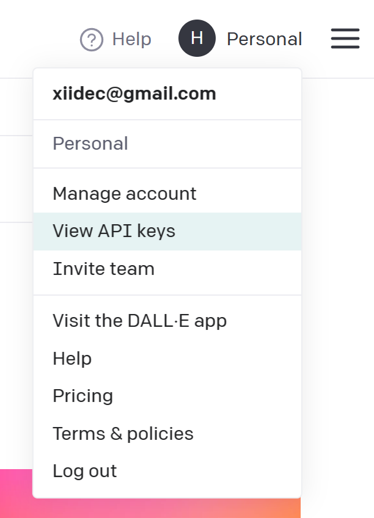
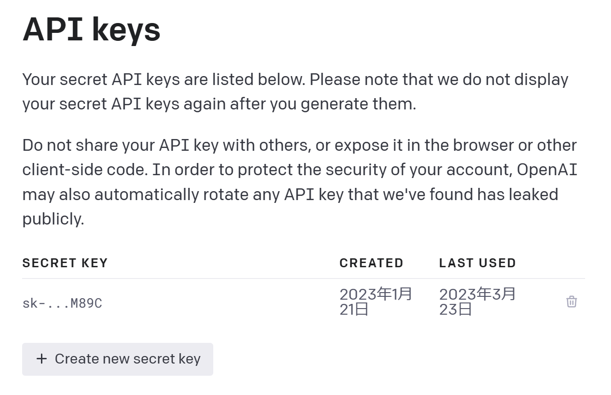
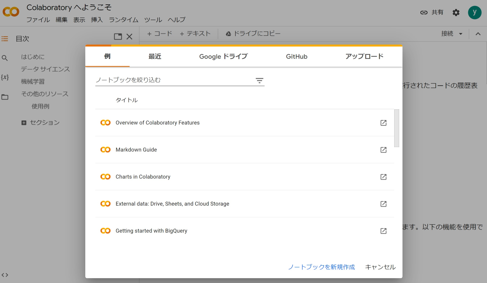
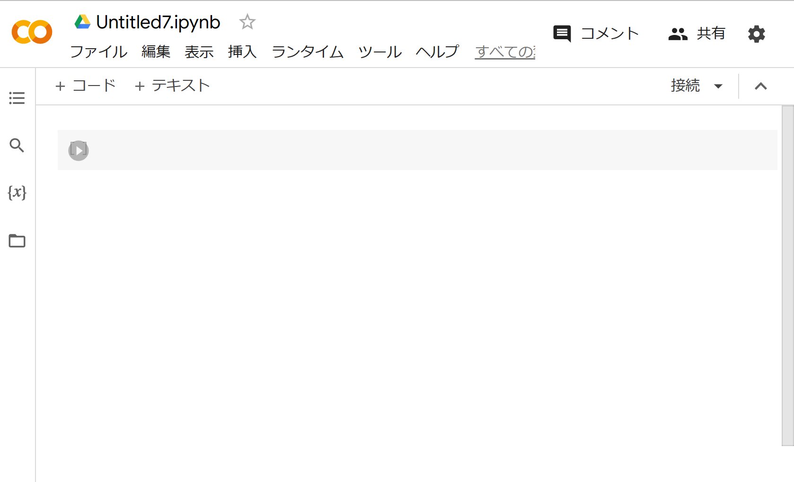
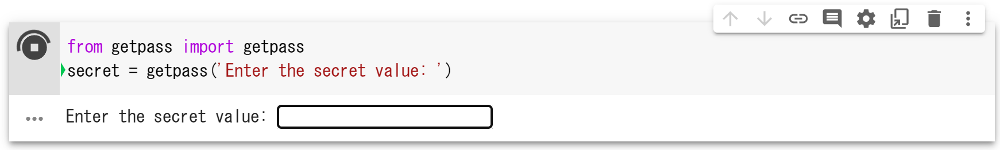
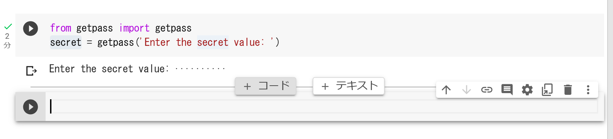

# Google Colab+PythonでOpenAIのAPIを利用する方法

## Google Colaboratoryとは

Google Colaboratory(通称Googole Colab)とは、Pytyon(など)をブラウザで実行できる環境です。
ソースコードだけでなく、図やドキュメントや実行結果をまとめてノートとして管理できるのでデータサイエンスの分野ではよく使われています。
Google Colabを使えば自分の書いたノートブックを共有し、他の人に簡単に実行して貰うことができます。

## OpenAIのAPIを使うのはPythonじゃないと駄目なの？

OpenAIのAPIはREST形式で公開されているので、どんな言語でも利用することができます。
とはいえPythonはAI関連のツールやエコシステムが他の言語に比べてかなり充実しているので、今回はPythonを利用します。


## Open AIのAPIキーを取得する

Open AIのAPIのサイトにアクセスします。

https://platform.openai.com/


右上のメニューからView API keysを選びます。



「Create new secret key」を押してシークレットキーを取得します。
画面を閉じると二度と表示されなくなるのでメモしてください。
このAPIキーは誰にも教えてはいけません。




## Google Colabを開く

以下のURLからGoogle Colabを開きます。

https://colab.research.google.com/

「ノートブックを新規作成」をクリックします。



すると以下のようなノートブックが表示されます。




## コードを書いていく

### APIキーの入力

1つめのコードボックスに以下を入力します。

```
from getpass import getpass
secret = getpass('Enter the secret value: ')
```

コードボックスの左側の実行ボタンを押すとコードが実行されます。
このコードはテキスト入力欄を表示し、Enterキーを押すと`secret`という変数に格納します。先ほど取得したAPIキーを入力してEnterを押してください。




### ライブラリのインストール

ボックスの下の真ん中らへんにカーソルを当てると追加ボタンがでてくるので、ボックスを追加してください。



以下を入力してください。
Google Colabでは、`!`を先頭につけるとシェルコマンドを実行することができます。
pipはPytonのパッケージシステムです。

```
!pip install openai 
```

書き終わったら実行してください。

### ライブラリのインポート

OpenAIのライブラリのインポートとシークレットキーのセットを行います。

```
import openai
openai.api_key = secret
```

### OpenAIのAPIにメッセージを投げる

`openai.ChatCompletion.create`でAIに質問を投げることができます。

```
completion = openai.ChatCompletion.create(
  model="gpt-3.5-turbo",
  messages=[
        {"role": "user", "content": "日本で二番目に高い山を教えて"}
    ]
)
```

modelというパラメータはAIの種類です。
`gpt-3.5-turbo`はChatGPT相当の賢さをもったAIです。
それよりやや性能に劣る`text-davinci-003`や、現在まだ一部の人にのみしか公開されていない`gpt-4`などがあります。

### 結果の表示

それでは結果を表示してみましょう。
結果は複数行で渡ってくることもあるので、以下のように書くことで結果をすべて表示することができます。

```
for cho in completion.choices:
  print(cho.message.content)
```

`日本で二番目に高い山は北アルプスにある槍ヶ岳（3,180m）です。`

### もう少し複雑なプロンプト

ChatGPTは質問文をそのまま投げるだけでも利用できますが、事前に例を与えてあげるとより賢い結果を返すことができます。

```
completion = openai.ChatCompletion.create(
  model="gpt-3.5-turbo",
  messages=[
        {"role": "system", "content": """あなたは俳句で喜怒哀楽や季節感を表現する詩人です。
俳句とは、5・7・5という音節数の文章を作ることを指します。
俳句の例として以下のようなものがあります。

* 古池や 蛙飛びこむ 水の音
* 若草や つわものどもが 夢の跡
* 柿食えば 鐘が鳴るなり 法隆寺
* 梅一輪 一輪ほどの あたたかさ
* 静かさや 岩にしみ入る 蝉の声
        """},
        {"role": "user", "content": "犬をテーマにして俳句を作ってください。"},
        {"role": "assistant", "content": "古来から 人と寄り添う 頼れる相棒"},
        {"role": "user", "content": "猫をテーマにして俳句を作ってください。"}
    ]
)
for cho in completion.choices:
  print(cho.message.content)
```

OpenAIのgpt-3.5-turboのAPIを利用する際には、メッセージにroleというパラメータを設定することができます。

|  role |  説明  |
| ---- | ---- |
|  system  |  「あなたは俳句を書く人です」などのシチュエーションの設定を指定する  |
|  user  |  ユーザーからのメッセージを指定する  |
|  assistant  |  AIの回答を指定する。模範解答をこちらから指定しても良い  |

上のプログラムでは、`system`でAIに世界観の説明をしています。そして１つ目の`user`と`assistant`で練習をして、２つ目の`user`であらためて本番の質問をしています。

このようにお膳立てしてあげると安定した解答が得られます。

`天高く ひとり佇む 黒猫の姿`
