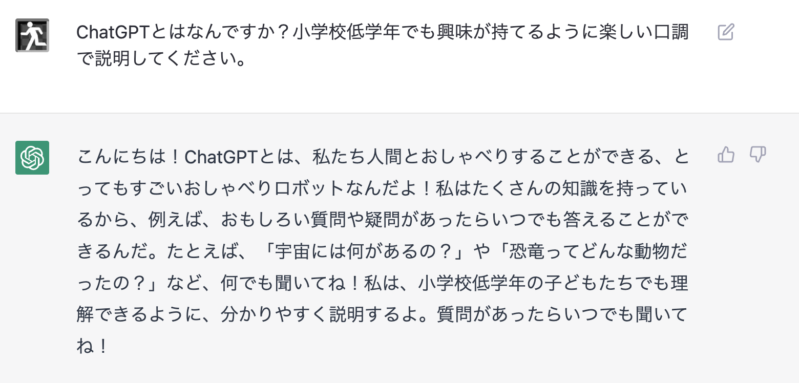

# ChatGPT / OpenAIとは
## ChatGPTとは

みなさんお馴染みの、対話形式でAIとチャットが出来るサービスです。
上の画像をみれば分かる通り、とても流暢に会話をすることができます。

## OpenAIとは

ChatGPTの開発元です。

Microsoftから11兆円以上の出資を受けており、AI界隈で最も注目される企業の1つです。

OpenAI社は営利を求める他の企業とは異なる独特な企業で、出資元のMicrosoftとは「[競合企業が安全なAGI(汎用人工知能)の開発に近づいた場合、
OpenAIは自社の研究を停止し、競合のプロジェクトに参加する](https://forbesjapan.com/articles/detail/60677/page3)」という契約を結んでいるようです。
OpenAIのCEOサム・アルトマンは「AGIが実現すれば資本主義を壊し、世界がより良い方向に向かうだろう」と言っています。
