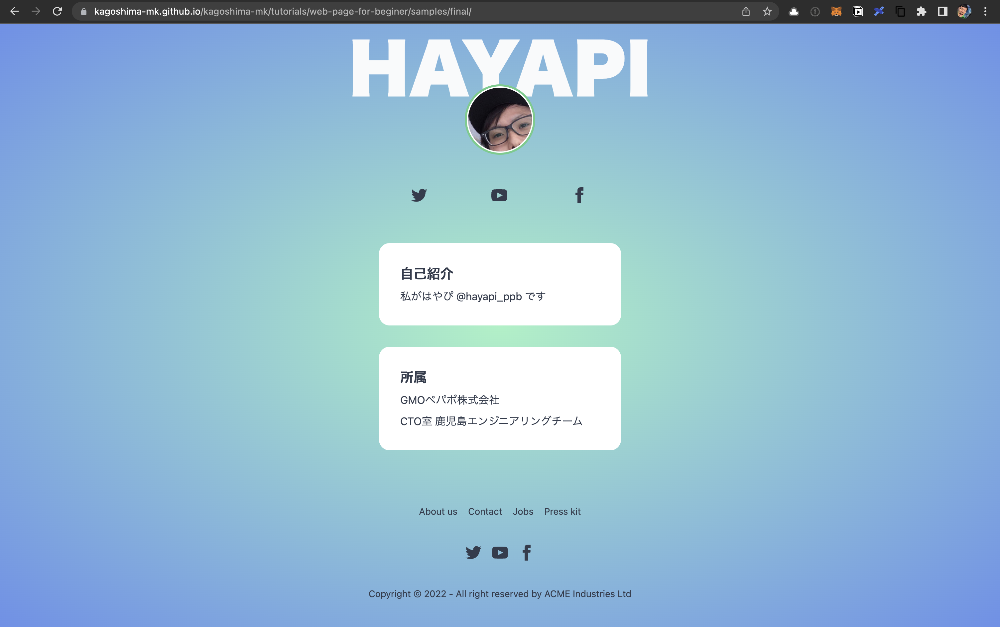
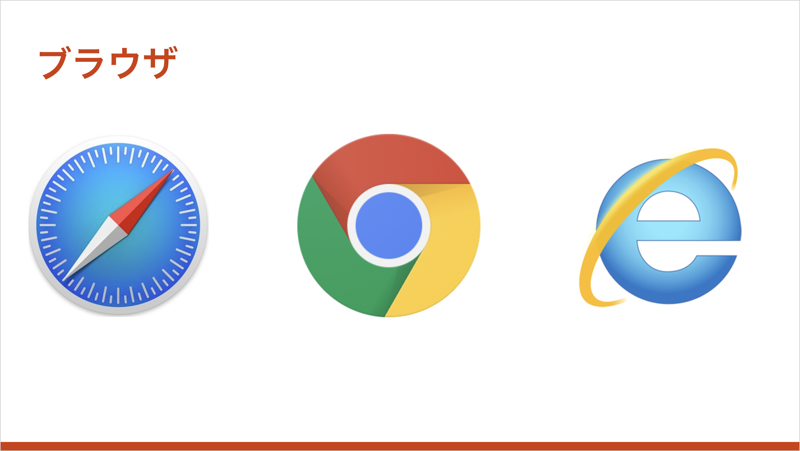
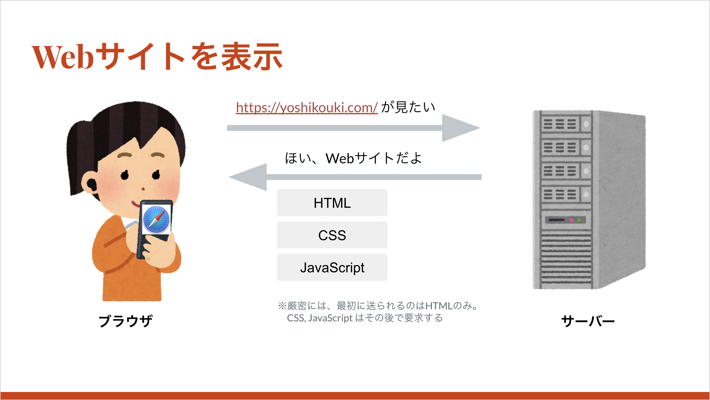
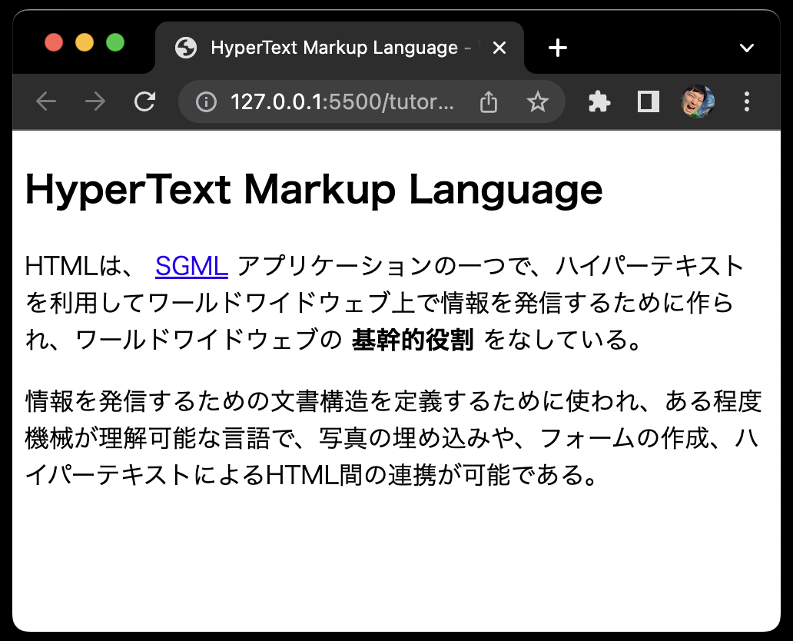
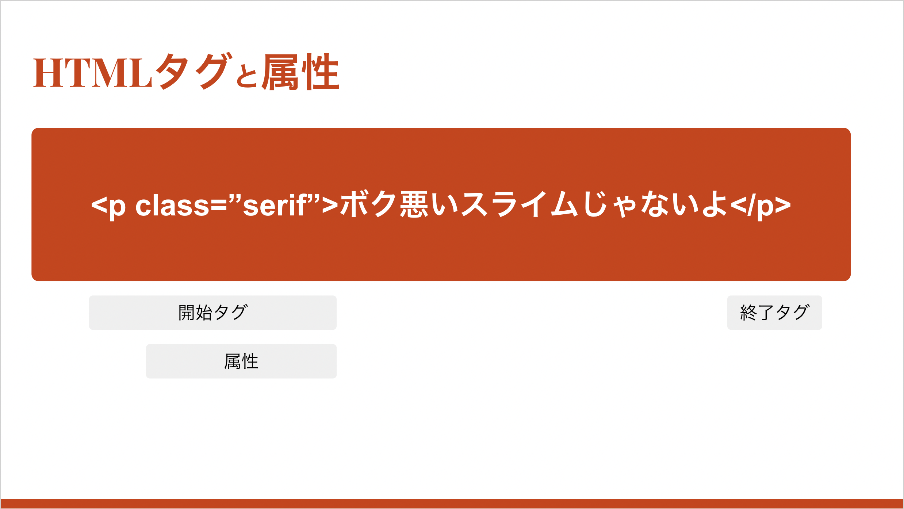
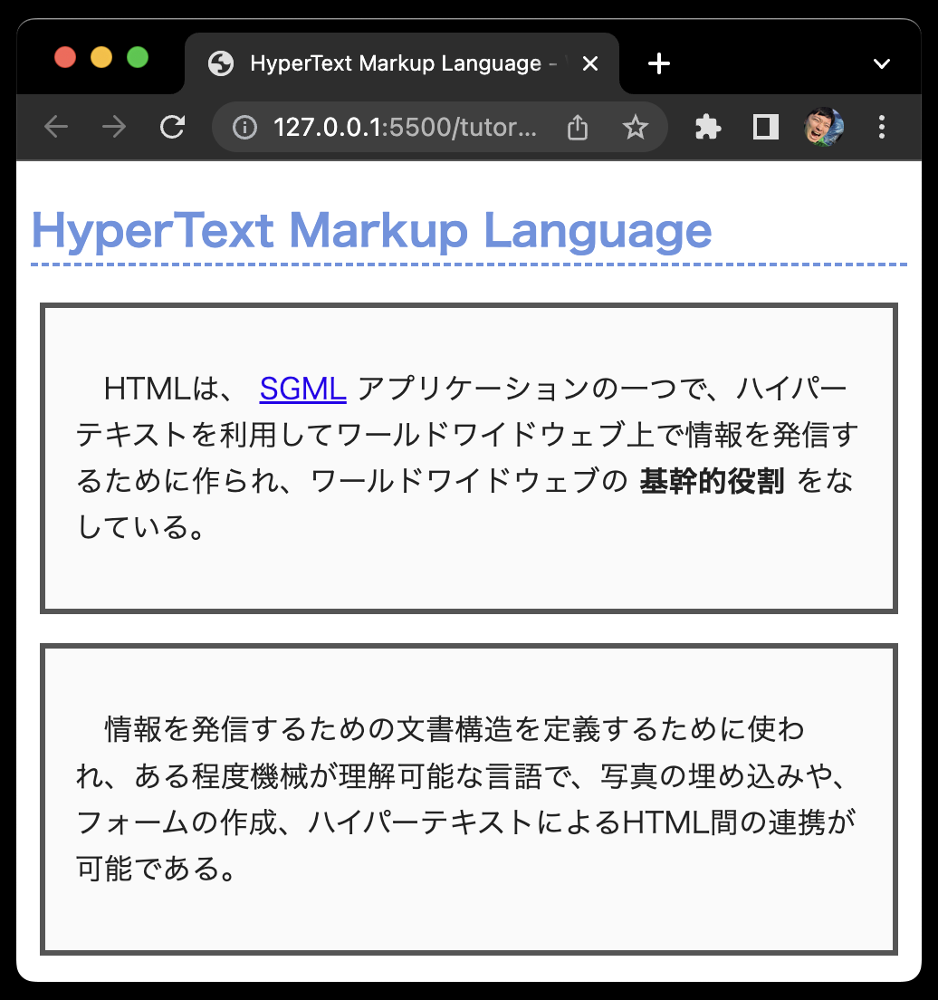
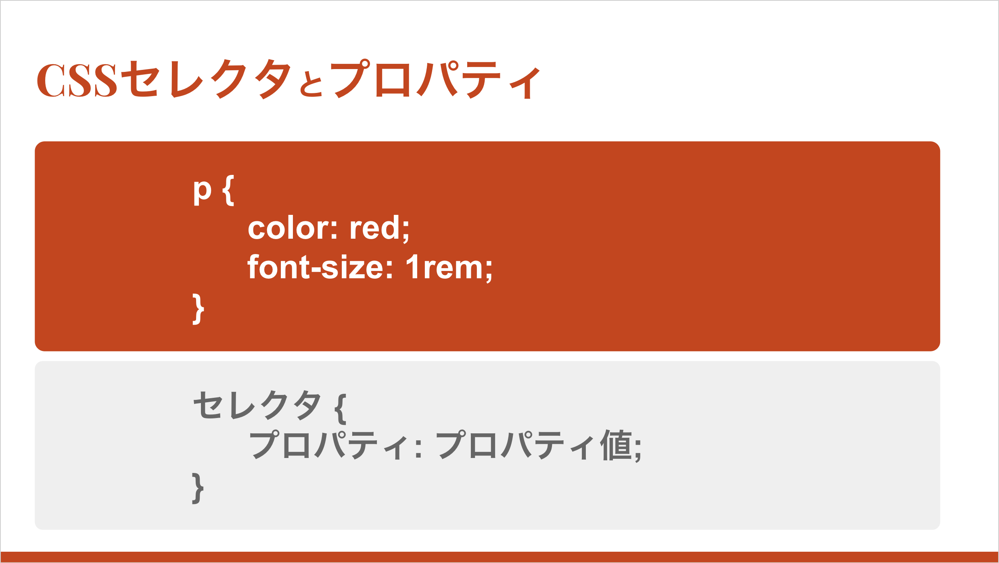

# Webサイト制作体験会 (HTML/CSS入門)

## 注意事項

- 当イベントで解説する内容は、暗記する必要はありません。
  - 「**はーん・・・こんなものがあるんだなー**」くらいで知っていただき、実践していく中で「**ふーん、ここでこれを書くのねー・・・で、これって何だったっけ？**」くらいで体験するだけで結構です
  - 最終的に「**なんかよく分からんけどお洒落になったやん！！！**」と楽しくなっていただくためのイベントです
- 後日、改めて自分のWebサイトを作ってみようと思った際に、「**全然覚えてないけど確かこんな感じのキーワードだったな**」と調べるときの足がかりになれば至幸です。

---

## Webサイトとは

- 今日作るWebサイトのサンプルは、以下のURLで公開しています (無料)
  - https://kagoshima-mk.github.io/kagoshima-mk/tutorials/web-page-for-beginer/samples/final/
  
- Webサイトは、ブラウザなどのアプリケーションを通して表示する、インターネット上のコンテンツです


- 主な登場人物には、HTML, CSS, JavaScript などがいます。

---

## HTML

- 全世界で標準化されている文章を記述するためのマークアップ言語 (プログラミング言語ではありません。※諸説あり)
- HyperText Markup Language（ハイパーテキスト マークアップ ランゲージ）
- [Wikipedia: HyperText_Markup_Language](https://ja.wikipedia.org/wiki/HyperText_Markup_Language)

```html
<!DOCTYPE html>
<html lang="ja">
  <head>
    <meta charset="UTF-8">
    <link rel="author" href="mailto:mail@example.com">
    <title lang="en">HyperText Markup Language - Wikipedia</title>
    <link rel="stylesheet" href="sample.css" />
  </head>
  <body>
    <article>
    <h1>HyperText Markup Language</h1>
    <p>
      HTMLは、
      <a href="http://ja.wikipedia.org/wiki/SGML">SGML</a>
      アプリケーションの一つで、ハイパーテキストを利用してワールドワイドウェブ上で情報を発信するために作られ、ワールドワイドウェブの
      <strong>基幹的役割</strong>
      をなしている。情報を発信するための文書構造を定義するために使われ、ある程度機械が理解可能な言語で、写真の埋め込みや、フォームの作成、ハイパーテキストによるHTML間の連携が可能である。
    </p>
    </article>
  </body>
</html>
```



- タグと属性
  
- もっと知りたい方はこちらがオススメ: [HTML の基本](https://developer.mozilla.org/ja/docs/Learn/Getting_started_with_the_web/HTML_basics)

### HTMLチートシート

- [HTML Living Standard ｜ HTML要素チートシート](https://htmlls.docs-share.com/)
- [【チートシート付き】コーディングで頻出のHTMLタグをまとめました](https://pengi-n.co.jp/blog/html-tag/)

---

## CSS

- HTMLなどに色や配置などのデザインを施すためのスタイルシート言語
- Cascading Style Sheets（CSS、カスケーディング・スタイル・シート、カスケード・スタイル・シート）
- https://ja.wikipedia.org/wiki/Cascading_Style_Sheets

```css
h1 {
  color: #6594e0; /*文字色*/
  border-bottom: dashed 2px #6594e0; /*線の種類（点線）2px 線色*/
}

p {
  margin: 1rem auto; /*外側の余白*/
  padding: 2rem 1rem; /*外側の余白*/
  width: 90%; /*幅*/
  font-size: 1rem; /*文字サイズ*/
  color: #222; /*文字色*/
  background: #fafafa; /*背景色*/
  border: 3px solid #555; /*枠*/
  font-weight: normal; /*文字の太さ*/
  line-height: 1.6; /*行間*/
  letter-spacing: 0.01rem; /*字間*/
  text-align: left; /*行揃え*/
  text-indent: 1rem; /*字下げ*/
};
```



- セレクタとプロパティ
  
- もっと知りたい方はこちらがオススメ: [CSS の基本](https://developer.mozilla.org/ja/docs/Learn/Getting_started_with_the_web/CSS_basics)

### CSSチートシート

- [CSSセレクタのチートシート｜37パターンを一覧で解説](https://webliker.info/css-selector-cheat-sheet/)

---

## CSSフレームワークを使用する

- CSSを全部覚えるのはとても大変だし面倒 (現役でも全部は覚えていない)
- またスタイルを一から当てるのも大変だし面倒 (時間かかるし似たコードをいっぱい書かないといけない)
- 大変だし面倒なことは、良い感じにしてくれるツールに頼っちゃおう！というときに、CSSフレームワークがあります
- 今回は、[daisyUI](https://daisyui.com/) と [tailwindcss](https://tailwindcss.com/) を使っておしゃれにします

### フレームワークを使用した場合の違い

|Before|After|
|---|---|
|||

Before

```html
<button>BUTTON</button>
```

After

```html
<button class="btn">Button</button>
<button class="btn btn-primary">Button</button>
<button class="btn btn-secondary">Button</button>
<button class="btn btn-accent">Button</button>
<button class="btn btn-ghost">Button</button>
<button class="btn btn-link">Button</button>
```

詳細は [https://daisyui.com/components/button/](https://daisyui.com/components/button/) を参考にしてください

---


## カリキュラム

1. [イベントの前準備](https://github.com/kagoshima-mk/kagoshima-mk#%E3%82%A4%E3%83%99%E3%83%B3%E3%83%88%E3%81%AE%E5%89%8D%E6%BA%96%E5%82%99)を行います
1. リポジトリをエディタ(VSCode)で開きます
1. [チュートリアル (このフォルダの `tutorial.md`)](https://github.com/kagoshima-mk/kagoshima-mk/blob/main/tutorials/web-page-for-beginer/tutorial.md)を参考にWebサイトを作っていきます

---

## 自習編

- 参考に作ったページを公開してみる
    1. Githubで「ユーザー名.github.io」といった名前のリポジトリを作る。(例:hayasaki-shunsuke.github.io)
    1. index.html、index.css,画像をリポジトリの直下にアップロードする。
    1. [Githubのヘルプ](https://docs.github.com/ja/pages/getting-started-with-github-pages/creating-a-github-pages-site)を参考にGithub Pagesを有効にする。
    1. `https://ユーザー名.github.io`にアクセスしてみる。
    
    分からないことがあれば気軽に質問してください。
    
- 更に勉強したい！という人はこちらがオススメです
  - [ウェブ入門 - ウェブ開発を学ぶ | MDN](https://developer.mozilla.org/ja/docs/Learn/Getting_started_with_the_web)

---

## チートシート
- HTMLチートシート
  - [HTML Living Standard ｜ HTML要素チートシート](https://htmlls.docs-share.com/)
  - [【チートシート付き】コーディングで頻出のHTMLタグをまとめました](https://pengi-n.co.jp/blog/html-tag/)

- CSSチートシート
  - [CSSセレクタのチートシート｜37パターンを一覧で解説](https://webliker.info/css-selector-cheat-sheet/)

---

## 便利なリンク集

- [Installation: Play CDN - Tailwind CSS](https://tailwindcss.com/docs/installation/play-cdn)

- [daisyUI - Tailwind CSS Components](https://daisyui.com/)

- [ウェブ入門 - ウェブ開発を学ぶ | MDN](https://developer.mozilla.org/ja/docs/Learn/Getting_started_with_the_web)
